# RNA-seq differential expression analysis using Galaxy

## 0. Getting started

Log in or register on the Fred Hutch Galaxy server at [http://galaxy.fredhutch.org](http://galaxy.fredhutch.org).
If your current history isn't empty, create a new one by clicking the gear icon at the top of the history pane to open the *History options* menu and selecting *Create New*.


Next, click on the history name, which defaults to "Unnamed history", and give it a more memorable name. (You'll have to hit the return key to save it; you can't just click away.)


## 1. Importing data from a data library

The data we'll be using is from a *Drosophila melanogaster* RNA-seq experiment.
Next we’ll import the reads sequenced for this experiment from a shared data library into our history.
In the menu bar, navigate to *Shared Data > Data Libraries* and select the “RNA-seq tutorial data” library.

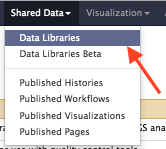

Tick the checkbox next to "Name" up at the top to select all 12 files in the library.
Make sure "Import to current history" is selected in the dropdown box at the bottom and then click *Go*.

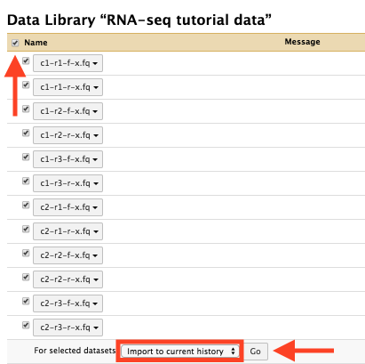

Return to the main Galaxy view by clicking *Analyze Data* in the menu bar.


## 2. Combining datasets into collections

The data for this experiment are paired-end (forward and reverse) reads for two experimental conditions, with three replicates for each condition.
To speed up the analysis for the purpose of this tutorial, the reads have been filtered to exclude all but the X chromosome.

The filenames are encoded as follows:

```
<condition>-<replicate>-<forward|reverse>-x.fq
```

For example, the file

```
c1-r2-f-x.fq

```

is a file containing condition 1 (`c1`), replicate 2 (`r2`) forward (`f`) reads on the X (`x`) chromosome in FASTQ (`fq`) format.
All 12 files end in `x` to denote that the reads are from the X chromosome.

To make the analysis easier, we'll combine the datasets for each condition into a *collection*: specifically, a *list of dataset pairs*.
Each sample's forward and reverse reads are associated into a dataset pair, and those dataset pairs are associated into one list for each condition.

### 2a. Building the condition 1 collection

First, click the *Operations on multiple datasets* button near the top of the history pane.

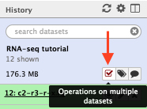

This adds checkboxes next to each dataset.
We'll build the list of dataset pairs for condition 1 first, so tick the checkboxes next to each of the six files that begin with `c1`.
Then, back up near the top of the history pane, click *For all selected... > Build List of Dataset Pairs*.

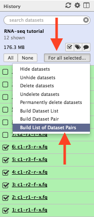

In the window that opens, you'll see two text entry fields, containing `_1` on the left and `_2` on the right.
This is Galaxy's default guess at how to tell the forward (left) and reverse (right) reads apart by filename, but in this case it's gotten it wrong.
Instead, type in `-f-x` in the left field and `-r-x` in the right field, and the datasets will appear.
Double-check that the datasets are paired up correctly (`c1-r1-f-x.fq` with `c1-r1-r-x.fq` and so on), then click *Pair these datasets* for each pair.

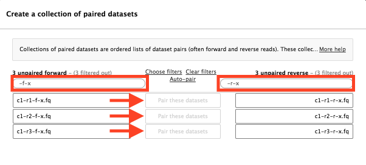

At the very bottom of the window, give the new collection a name like "condition 1 reads" and click *Create list*.

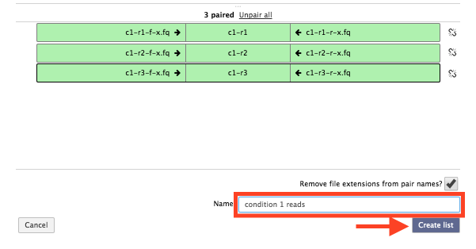


### 2b. Building the condition 2 collection

Clear the checkboxes for the six files that begin with `c1` and tick those next to the six files that begin with `c2` instead.
Then follow the same steps as above for filtering, pairing, naming, and creating the list for the condition 2 datasets.

Finally, click the *Operations on multiple datasets* button again to turn off the checkboxes.


## 3. Fetching a gene annotation from UCSC

Next we'll fetch a gene annotation using the UCSC Table Browser.
This tool allows access to the same data available for visualization in the UCSC Genome Browser.

In the tool pane on the left hand side, select *Get Data > UCSC Main*.
Use the following settings:

* clade: **Insect**
* genome: **D. melanogaster**
* assembly: **Apr. 2006 (BDGP R5/dm3)**
* group: **Genes and Gene Predictions**
* track: **RefSeq Genes**
* region: (select *position*) **chrX**
* output format: **GTF - gene transfer format**

It should look like the following:

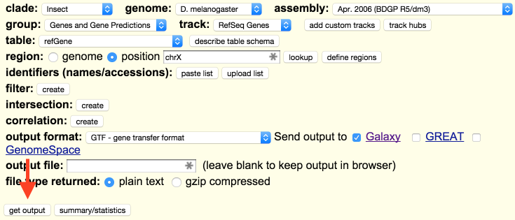

Once you're satisfied the settings are correct, click the *Get output* button near the bottom of the page, then click *Send query to Galaxy* on the next page.
After a moment you'll be returned to the main Galaxy view and a new queued GTF dataset will appear in your history.

It's worth mentioning at this point that in most cases jobs can be configured and submitted even if the datasets they depend on are still queued or running -- so you can continue on even if you're still waiting for the GTF to download.


## 4. Mapping reads with TopHat

[TopHat](https://ccb.jhu.edu/software/tophat/index.shtml) is a splice-aware mapper designed for RNA-seq reads.

One thing we'll need to know in order to improve the mapping accuracy is the mean inner distance between the paired reads.
That distance is determined as follows.
From the wet lab that produced this data, the insert size is given as 178 bp.
The reads are paired-end with a read length of 75 bp.
Thus the expected inner distance between mate pairs is 178 - (75 + 75) = 28 bp.


### 4a. Mapping condition 1 reads

In the tool pane, select *NGS: Mapping > TopHat*.
Change the following settings from their defaults:

* Is this single-end or paired-end data: **Paired-end (as collection)**
* RNA-Seq FASTQ paired reads: **condition 1 collection from step 2a**
* Mean Inner Distance between Mate Pairs: **28** (see above)
* Select a reference genome: **Fruit Fly (Drosophila melanogaster): dm3**
* TopHat settings to use: **Full parameter list**

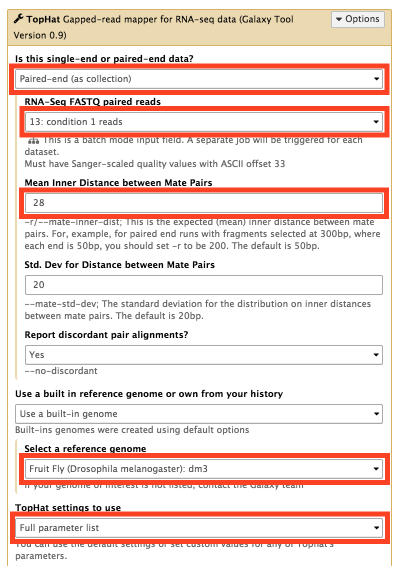

Selecting "Full parameter list" will reveal many more parameters.
Scroll down a ways through the expanded parameters, and set the following:

* Do you want to supply your own junction data: **Yes**
* Use Gene Annotation Model: **Yes**
* Gene Model Annotations: **UCSC Main RefSeq genes GTF from step 3**

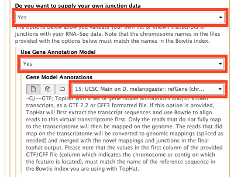

Finally, click the *Execute* at the bottom of the options to submit the job.

### 4b. Mapping condition 2 reads

Follow the same steps as above, except for the following setting:

* RNA-Seq FASTQ paired reads: **condition 2 collection from step 2b**

Now we have two sets of output collections from TopHat, one for condition 1, and another for condition 2.
Unfortunately, TopHat does not carry over the name of the input collection to its outputs, but we do know that we submitted the job for condition 1 first -- so when we need to discern between them, the collection with the smaller ID number (next to the dataset name) corresponds to condition 1.
We'll use this guideline in step 6.


## 5. Examining TopHat's output

TopHat produces a number of files for each run.
Specifically:

* `align_summary` (text)
* `insertions` (BED)
* `deletions` (BED)
* `splice_junctions` (BED)
* `accepted_hits` (BAM)

In the next step, we'll be using the `accepted_hits` datasets, which are the mapped and aligned reads, to determine the expression levels of the genes annotated in the GTF we obtained from UCSC.

Before that, though, click on one of the `align_summary` collections, then click the eye icon to view one of the datasets in the collection.
Since the reads we're using for this tutorial all have pretty high quality scores, the mapping and alignment rates shown should be very high.
If they're not, something went wrong!

If you ever need to double-check your inputs, or you just want to see how a dataset was generated, you can click on the dataset name in the history to expand it, then click the "information" icon to see the dataset details.

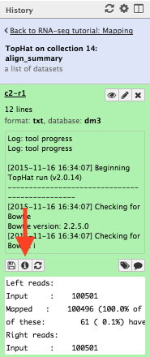

Along with some internal information about the dataset, the tool parameters used to generate the dataset will be listed at the bottom of the details page.


## 6. Counting reads mapping to genes with htseq-count

To determine the gene expression levels in each sample, we'll use [htseq-count](http://www-huber.embl.de/users/anders/HTSeq/doc/count.html).


### 6a. Counting condition 1 hits

In the tool pane, select *NGS: RNA-Seq > htseq-count*.
Change the following settings from their defaults:

* Aligned SAM/BAM File: (click "collections" icon) **TopHat accepted_hits for condition 1 from step 4a**
* GFF File: **UCSC Main RefSeq genes GTF from step 3**
* Stranded: **No**

Remember that the condition 1 collection will have the smaller ID number!

Finally, click the *Execute* button to submit the job.


### 6b. Counting condition 2 hits

Follow the same steps as above, except for the following setting:

* Aligned SAM/BAM File: (click "collections" icon) **TopHat accepted_hits for condition 2 from step 4b**

Remember that the condition 2 collection will have the larger ID number!


## 7. Testing for differential expression with DESeq2

We'll use [DESeq2](http://genomebiology.biomedcentral.com/articles/10.1186/s13059-014-0550-8) to test for differential expression, partly because it's quite fast, and partly because it works well for small studies with few replicates.

Change the following settings from their defaults:

* Factor 1 > Specify a factor name: **condition**
* Factor 1 > Factor level 1 > Specify a factor level **c1**
* Factor 1 > Factor level 1 > Counts file(s): (click "collections" icon) **htseq-count collection for condition 1 from step 6a**
* Factor 1 > Factor level 2 > Specify a factor level **c2**
* Factor 1 > Factor level 2 > Counts file(s): (click "collections" icon) **htseq-count collection for condition 2 from step 6b**

Remember that the condition 1 collection will have the smaller ID number!
The factor and factor level names can be anything you wish provided that they contain only letters, numbers, and underscores.

It should look like the following:

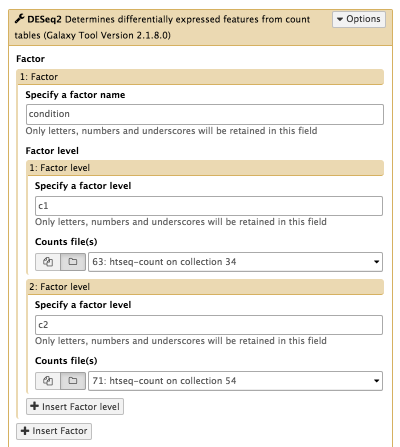

After setting the above parameters, click the *Execute* button to submit the job.


## 8. Examining results

DESeq2 produces both graphical and tabular output.
The plots are:

* principal component analysis
* sample clustering
* dispersion estimates
* a histogram of p-values
* an MA plot of log~2~ fold change vs. mean normalized counts across all samples and replicates

From the sample clustering and the principal component analysis plots, does it look like there is a difference between the samples for condition 1 and condition 2?

In the MA plot, red points denote significant (FDR-adjusted p < 0.05) differences in expression of a gene, while black points denote insignificant differences.
Are there any significant differences?

The tabular output can also help you answer that last question. It contains seven columns:

* gene ID
* mean normalized counts
* log~2~ fold change
* log~2~ fold change error
* test statistic
* p-value
* FDR-adjusted p-value

Are there any rows for which the 7th column is less than 0.05?
If so, for what gene ID(s)?
